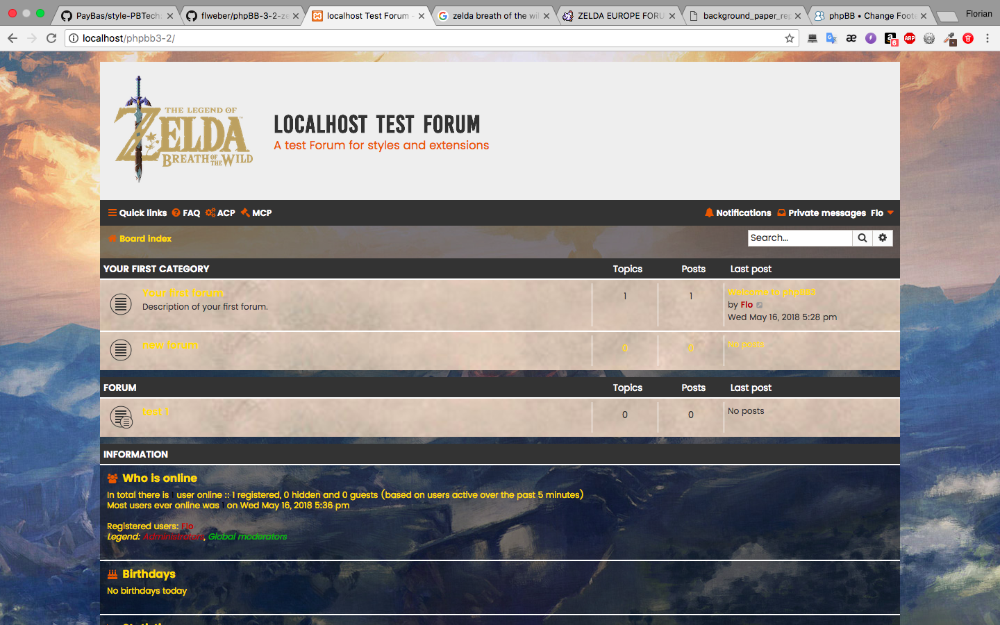

# Zelda Style for phpBB 3.2

## Getting Started
### Requirements
- phpBB 3.2
- prosilver 3.2
### Installing
- prosilver needs to be installed to use this style (check your ACP to be sure)
- Download the style [here](https://github.com/flweber/phpBB-3-2-zelda_style/releases)
- Unpack the ZIP-Archiv and copy the folder in the styles directory of your phpBB installation
- Navigate to your ACP->Customize->Install Styles and click on install behind > Zelda Style
## Features
- [x] Zelda Background
- [x] Parchment style
- [x] Fantasy style colors
- [ ] diversified colors
- [ ] optimized link style
- [ ] Zelda style header
## Important information
### Authors
- Florian Weber _[FLWEBER](https://github.com/flweber)_
See also the list of [contributors](https://github.com/flweber/phpBB-3-2-zelda_style/graphs/contributors) who participated in this project.
### License
This project is licensed under the MIT License - see the [LICENSE](https://github.com/flweber/phpBB-3-2-zelda_style/blob/master/LICENSE) file for details
### Copyright
- This style is based on the Flat Style by [Ian Bradley](http://iansvivarium.com/)
- All rights reserved by Ian Bradley
